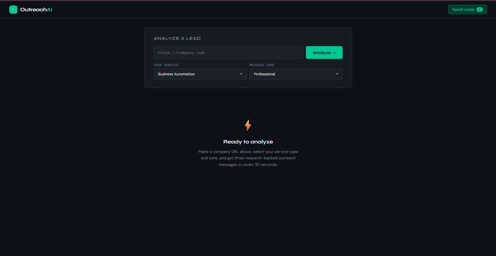
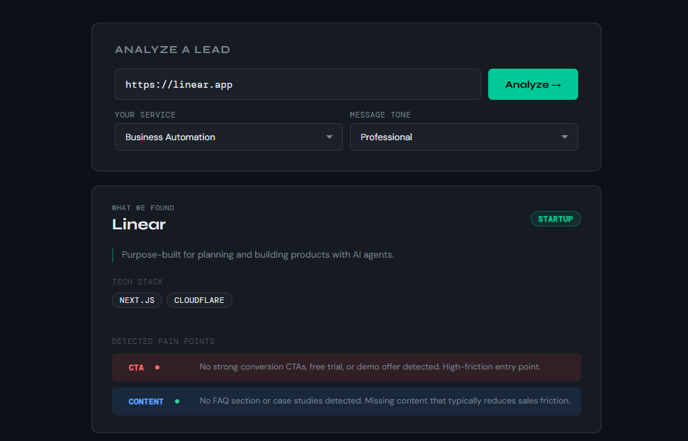
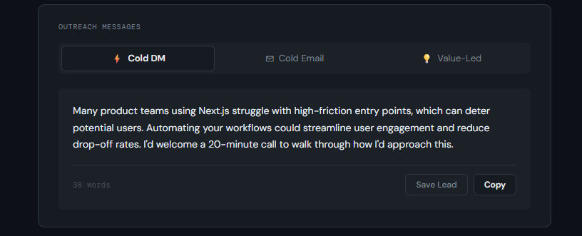
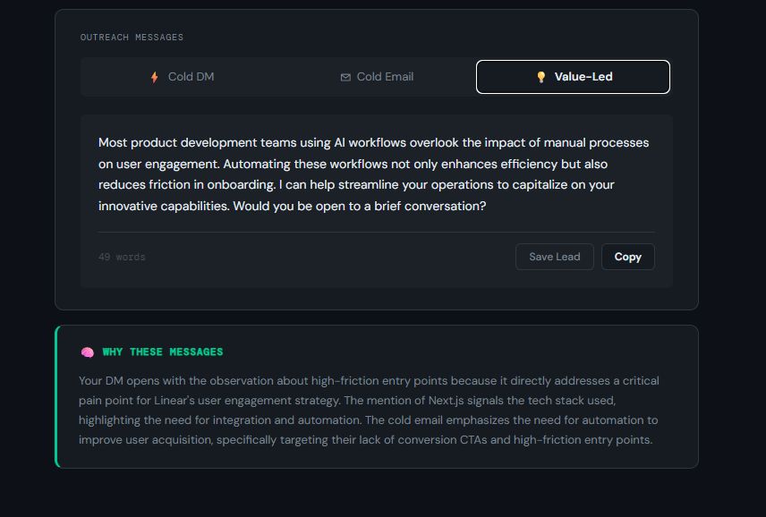

<div align="center">

# ⚡ OutreachAI

### AI-Powered Lead Intelligence & Personalized Outreach System

*Paste a company URL. Get three research-backed cold outreach messages in under 30 seconds.*

<br/>

[](https://python.org)
[](https://fastapi.tiangolo.com)
[](https://reactjs.org)
[](https://openai.com)
[](LICENSE)

<br/>

**[📺 Watch Demo](https://youtube.com/your-link-here)** &nbsp;·&nbsp; **[🌐 Portfolio](https://portfolio-sigma-beryl-11.vercel.app)**

<br/>



</div>

---

## The Problem

Freelancers spend **20–40 minutes per prospect** writing personalized cold outreach.

Most AI writing tools generate generic text that could apply to any company — because they know nothing about the company. The result: low reply rates, wasted time, and a pipeline that stalls before it starts.

## The Solution

OutreachAI extracts real intelligence from a company's website — their tech stack, UX weaknesses, missing automation signals, CTA gaps — and uses that structured context to generate outreach that sounds like you spent an hour researching the prospect.

Not a template filler. A **research pipeline** with an AI writer on top.

---

## How It Works

```
URL Input  →  Website Analysis  →  Pain Point Detection  →  AI Generation  →  3 Message Variants + Explanation
```

1. Paste a company URL and select your service type and message tone
2. The system fetches and parses the website in real time
3. It extracts structured company intelligence and categorizes pain points
4. That context is injected into a carefully engineered prompt
5. GPT-4o-mini generates three outreach variants and a strategic explanation — in a single API call

---

## Features

### 🔍 Real-Time Website Analysis

Fetches and parses any business website using `httpx` + `BeautifulSoup4`. Extracts:

- Company name, description, and target audience
- Tech stack — 20+ technologies detected from HTML and response headers
- Company tone — startup, professional, or casual
- Pricing tier signals — budget, mid, or premium
- Location from address tags and body text patterns

### 🩺 Five-Category Pain Point Detection

Automatically identifies business weaknesses and maps them to freelance service opportunities:

| Category | What It Detects | Severity |
|---|---|---|
| **UX** | Missing social proof, weak trust signals, no testimonials | Medium |
| **CTA** | No free trial, no demo offer, low-friction entry points absent | High / Medium |
| **Automation** | Manual process signals, form-based workflows, "email us" patterns | High / Medium |
| **Content** | Thin copy, no FAQs, no case studies | Low / Medium |
| **Performance** | WordPress + jQuery bloat, heavy plugin indicators | Low |



### 🤖 Three Outreach Variants Per Analysis

Each variant is adapted to the extracted company context, your service type, and your chosen tone:

| Variant | Format | Best For |
|---|---|---|
| **Cold DM** | ~55 words | LinkedIn / Twitter direct message |
| **Cold Email** | ~120 words + subject line | Email outreach |
| **Value-Led** | ~100 words, insight-first opening | High-value prospects |

**Tone Control** — choose how you want to come across:

- `Professional` — polished and credible, like a senior consultant
- `Casual` — conversational and peer-like
- `Bold` — direct and slightly provocative

**Service Context** — the AI adapts messaging for:

- Business Automation
- AI Chatbot
- Web Scraping
- Data Dashboard
- SaaS MVP Development



### 🧠 Explanation Layer

After every analysis, the system explains *why* each message was written the way it was — referencing the specific signals it detected. This turns a black-box output into a strategy tool you can learn from and trust.

> *"Your DM leads with the absence of a free trial because the site shows premium pricing signals with no low-friction entry point — that gap is directly addressable with a chatbot that qualifies and onboards leads automatically."*



### 💾 Leads History

Save any analysis and reload it later. Every saved lead stores the full company profile, all three messages, and the explanation — accessible from the sidebar without re-analyzing.

---

## Tech Stack

| Layer | Technology | Purpose |
|---|---|---|
| **Frontend** | React 18 + Vite | Single-page application |
| **Styling** | Pure CSS variables | Design system — no UI library |
| **Backend** | FastAPI, Python 3.11 | API layer and orchestration |
| **AI** | OpenAI GPT-4o-mini | Message and explanation generation |
| **HTTP Client** | httpx (async) | Website fetching |
| **HTML Parser** | BeautifulSoup4 | Data extraction |
| **Database** | SQLite + SQLAlchemy | Lead persistence |
| **Validation** | Pydantic v2 | Request and response schemas |
| **Fonts** | Syne · DM Sans · DM Mono | Typography system |

---

## Project Structure

```
outreach-ai/
├── backend/
│   ├── main.py                  # FastAPI app entry point + CORS
│   ├── database.py              # SQLite engine + session factory
│   ├── models.py                # SQLAlchemy Lead model
│   ├── schemas.py               # Pydantic schemas
│   ├── requirements.txt
│   ├── routers/
│   │   ├── analyze.py           # POST /api/analyze — core pipeline
│   │   └── leads.py             # GET / POST / DELETE /api/leads
│   ├── services/
│   │   ├── extractor.py         # Website fetch + HTML parsing
│   │   ├── prompt_builder.py    # Prompt construction
│   │   └── ai_service.py        # OpenAI REST call + JSON parsing
│   └── utils/
│       └── tech_detector.py     # Technology fingerprinting
│
├── frontend/
│   └── src/
│       ├── App.jsx              # Root component + state
│       ├── index.css            # CSS variables design system
│       ├── api/
│       │   └── client.js        # Axios instance
│       ├── hooks/
│       │   ├── useAnalyze.js    # Analysis state + API call
│       │   └── useLeads.js      # Leads CRUD
│       └── components/
│           ├── Navbar.jsx
│           ├── InputPanel.jsx
│           ├── InsightsPanel.jsx
│           ├── MessagesPanel.jsx
│           ├── MessageCard.jsx
│           ├── ExplanationPanel.jsx
│           ├── LeadsHistory.jsx
│           ├── LoadingState.jsx
│           └── EmptyState.jsx
│
└── docs/
    └── screenshots/
```

---

## API Reference

| Method | Endpoint | Body | Description |
|---|---|---|---|
| `POST` | `/api/analyze` | `{ url, service_type, tone }` | Core pipeline — extract + generate |
| `GET` | `/api/leads` | — | Get all saved leads |
| `POST` | `/api/leads` | `{ url, company_name, ... }` | Save a lead and its messages |
| `DELETE` | `/api/leads/{id}` | — | Delete a saved lead |

---

## Local Setup

### Prerequisites

- Python 3.11
- Node.js 18+
- OpenAI API key

### Backend

```bash
# Clone the repository
git clone https://github.com/BadrDyane/outreach-ai.git
cd outreach-ai/backend

# Create and activate virtual environment
py -3.11 -m venv venv
venv\Scripts\activate        # Windows
# source venv/bin/activate   # macOS / Linux

# Install dependencies
pip install -r requirements.txt

# Create environment file
echo OPENAI_API_KEY=your_key_here > .env

# Start the server
uvicorn main:app --reload --port 8000
```

Backend runs at `http://localhost:8000`

### Frontend

```bash
cd ../frontend

# Install dependencies
npm install

# Start dev server
npm run dev
```

Frontend runs at `http://localhost:5173`

---

## Design Decisions

**Why direct REST calls instead of the OpenAI SDK?**
The OpenAI Python SDK has SSL/httpx timeout issues on Windows in certain environments. Direct `requests` calls are more reliable and keep the dependency surface minimal.

**Why SQLite instead of PostgreSQL?**
OutreachAI is a single-user tool. SQLite is zero-config, deploys without Docker, and is the right choice for this scope. PostgreSQL becomes appropriate when adding multi-user accounts.

**Why a single AI call for all four outputs?**
Generating cold_dm, cold_email, value_led, and explanation in one call minimizes latency and cost, and ensures the explanation stays coherent with the messages it describes.

**Why not Playwright for scraping?**
`httpx` handles approximately 80% of real business websites cleanly. Adding Playwright significantly increases complexity and deployment cost. The limitation is documented — JS-heavy SPAs may return partial data.

---

## Known Limitations

- **JavaScript-rendered SPAs** — sites that render entirely client-side with no SSR may return limited extraction data
- **Bot-protected sites** — some sites actively block automated requests and will return no data
- **Extraction depth** — output quality depends on the structure and content richness of the target site

---

## Roadmap

- [ ] Railway + Vercel deployment
- [ ] Playwright fallback for JS-heavy sites
- [ ] Lead scoring system
- [ ] Follow-up message generation
- [ ] CSV export
- [ ] Batch URL analysis

---

## Built By

<div align="center">

**Badr Dyane**
Full-Stack AI & Automation Engineer

[](https://portfolio-sigma-beryl-11.vercel.app)
[](https://github.com/BadrDyane)
[](mailto:badrdyane@gmail.com)

*Open to freelance projects — AI tools, automation systems, full-stack development*

</div>

---

<div align="center">
⭐ If this project was useful or interesting, consider giving it a star
</div>
